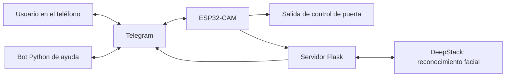

# EasyHub
### Control de acceso y automatización mediante ESP32-CAM, Telegram y reconocimiento facial

**Proyecto académico · Internet de las cosas · Sistemas embebidos · Servicios en la nube**

EasyHub se desarrolló como un prototipo para gestionar el acceso a un espacio desde el teléfono. Combina un dispositivo con cámara, una interfaz de Telegram y un servidor de reconocimiento facial. Su propuesta es recibir avisos de visitas, consultar fotografías y controlar una salida de apertura de puerta a distancia.

Este repositorio presenta el trabajo y las evidencias conservadas. El código fuente, las credenciales y los componentes necesarios para reproducir el sistema se mantienen fuera de esta publicación.

## El problema y la propuesta

El proyecto exploró cómo integrar identificación de visitantes y control remoto en un dispositivo conectado. La interacción se centralizó en Telegram para utilizar el teléfono como interfaz, mientras la ESP32-CAM capturaba imágenes y el servidor procesaba solicitudes de reconocimiento.

La documentación original también contempla un dispositivo secundario para controlar equipos convencionales. Su funcionamiento se describe en el material tutorial; no se recuperó su firmware para verificarlo.

## Trabajo desarrollado

| Área | Trabajo identificado |
|---|---|
| Dispositivo con cámara | Programación de ESP32-CAM AI Thinker para capturar imágenes, detectar el timbre y controlar indicadores y una salida de puerta |
| Comunicación | Integración de Wi-Fi, solicitudes HTTP y envío de fotografías y avisos a Telegram |
| Configuración | Gestión de credenciales locales y portal de configuración mediante Preferences y WiFiManager |
| Reconocimiento facial | Integración de un servidor Flask con las API de registro e identificación de DeepStack |
| Control desde el teléfono | Menús de Telegram para interacción y control del dispositivo |
| Ayuda al usuario | Bot Python con tutoriales, menús, verificación de administrador y cierre por inactividad |
| Versiones del firmware | Variantes con selección de señas, duración temporal del acceso y solicitudes de gestión de usuarios y estadísticas |
| Nube | Uso académico reportado de Docker y DigitalOcean para un despliegue temporal |

Las versiones recuperadas incluyen solicitudes para señas, usuarios y estadísticas. No se recuperó el servidor que atiende esas funciones, por lo que su implementación completa no se afirma en esta presentación.

## Cómo se conectaban los componentes

El dispositivo captura una imagen y solicita su procesamiento al servidor. El servidor consulta el servicio de reconocimiento y devuelve información de identidad. Telegram proporciona una vía de notificación e interacción. El bot de ayuda es un componente adicional; el esquema representa las responsabilidades encontradas y no garantiza compatibilidad inmediata entre todas las versiones.

## Tecnologías utilizadas

| Capa | Tecnologías |
|---|---|
| Hardware | ESP32-CAM AI Thinker |
| Firmware | Arduino / C++ |
| Red y configuración | WiFi, WiFiClientSecure, Preferences, WiFiManager |
| Mensajería | Telegram, UniversalTelegramBot, python-telegram-bot |
| Servidor | Python, Flask, requests |
| Identificación facial | DeepStack |
| Infraestructura académica | Docker y DigitalOcean |

## Evidencias del proyecto

Las imágenes siguientes son material tutorial original recuperado. Documentan el diseño y la guía de uso; no sustituyen una prueba actual del sistema ni representan métricas de rendimiento.

### Instalación y concepto de dispositivos

La guía describe la ubicación del dispositivo principal con cámara y un dispositivo secundario orientado a automatización.

### Control a través de Telegram

El material explica la interacción mediante un grupo y un bot, con permisos de administración para el control.

### Vinculación con el chat

Se elaboró una guía para obtener el identificador del chat y vincular la interfaz de mensajería con el dispositivo.

Los nombres de bots mostrados corresponden al material histórico; no se presentan como servicios actualmente disponibles ni como instrucciones para utilizar un sistema activo.

## Alcance y estado actual

El despliegue en la nube fue temporal por tratarse de un proyecto académico. Actualmente el servicio no está activo.

Se conservaron cuatro variantes del firmware, un servidor Flask de reconocimiento y registro facial, un bot Python y material tutorial. La revisión de estos archivos permitió documentar los componentes y sus conexiones sin publicar el código completo.

No se dispone de una prueba integral actual, métricas de precisión, el backend completo de señas y estadísticas ni la configuración original reproducible de Docker. La versión de firmware numerada 1.5 es la de numeración más alta recuperada, pero no se confirmó que fuera la última desplegada.

## Competencias aplicadas

- Programación de microcontroladores y gestión de periféricos.
- Integración de dispositivos físicos con servicios HTTP.
- Desarrollo de bots e interfaces de mensajería.
- Integración de servicios de reconocimiento facial.
- Configuración de servicios y despliegue académico en la nube.
- Elaboración de tutoriales para instalación y uso.

La descripción corresponde al trabajo del proyecto. La distribución exacta de tareas entre integrantes no se documenta aquí y no debe interpretarse como autoría individual exclusiva.

## Próxima etapa

Como evolución futura se contempla consolidar versiones, recuperar o reconstruir los servicios faltantes, mejorar autorización y comunicación, y realizar pruebas de hardware e integración antes de una implementación real.

## Sobre esta publicación

Este es un repositorio de **documentación de portafolio**, no una distribución del sistema. No contiene firmware, servidor ejecutable, configuración de despliegue, imágenes Docker, modelos ni credenciales. El material se presenta para explicar el proyecto y mostrar evidencias de su desarrollo académico.
