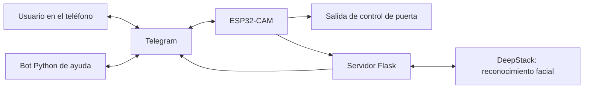
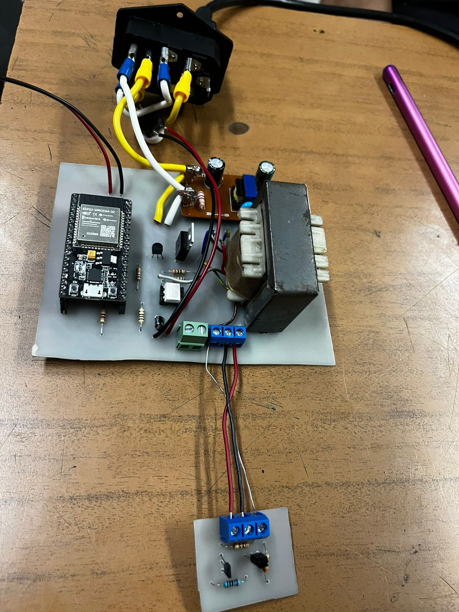
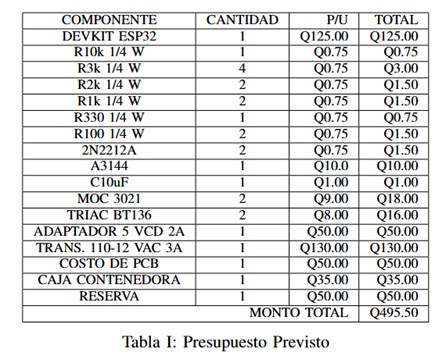
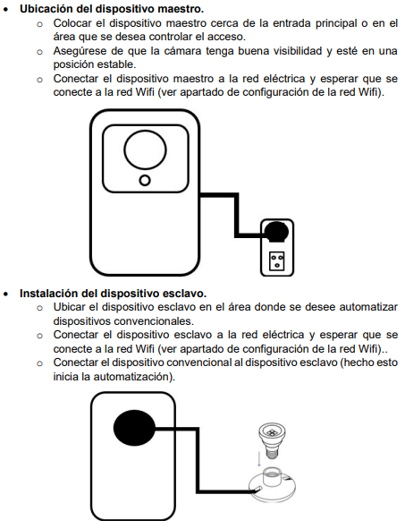
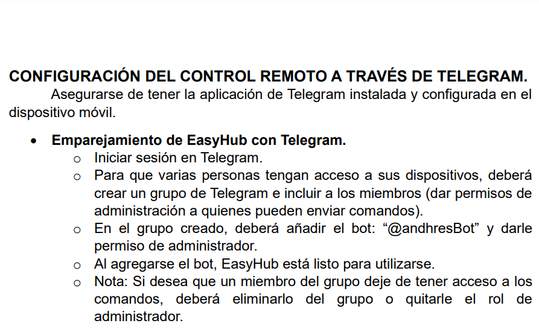
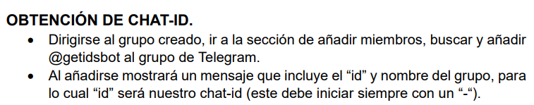

# EasyHub
### Control de acceso y automatización mediante ESP32-CAM, Telegram y reconocimiento facial

**Proyecto académico · Internet de las cosas · Sistemas embebidos · Servicios en la nube**

EasyHub se desarrolló como un prototipo para gestionar el acceso a un espacio desde el teléfono. Combina un dispositivo con cámara, una interfaz de Telegram y un servidor de reconocimiento facial. Su propuesta es recibir avisos de visitas, consultar fotografías y controlar una salida de apertura de puerta a distancia.

Este repositorio presenta el trabajo y las evidencias conservadas. El código fuente, las credenciales y los componentes necesarios para reproducir el sistema se mantienen fuera de esta publicación.

## El problema y la propuesta

El proyecto exploró cómo integrar identificación de visitantes y control remoto en un dispositivo conectado. La interacción se centralizó en Telegram para utilizar el teléfono como interfaz, mientras la ESP32-CAM capturaba imágenes y el servidor procesaba solicitudes de reconocimiento.

La documentación original también contempla un dispositivo secundario para controlar equipos convencionales. Su funcionamiento se describe en el material tutorial.

## Trabajo desarrollado

| Área | Trabajo identificado |
|---|---|
| Dispositivo con cámara | Programación de ESP32-CAM AI Thinker para capturar imágenes, detectar el timbre y controlar indicadores y una salida de puerta |
| Comunicación | Integración de Wi-Fi, solicitudes HTTP y envío de fotografías y avisos a Telegram |
| Configuración | Gestión de credenciales locales y portal de configuración mediante Preferences y WiFiManager |
| Reconocimiento facial | Integración de un servidor Flask con las API de registro e identificación de DeepStack |
| Control desde el teléfono | Menús de Telegram para interacción y control del dispositivo |
| Ayuda al usuario | Bot Python con tutoriales, menús, verificación de administrador y cierre por inactividad |
| Diseño electrónico | Diseño documentado en Proteus de etapas de control y potencia, con referencias a optoacopladores, TRIAC, transistores y sensor de efecto Hall |
| Construcción física | Integración de un ESP32-WROOM y componentes electrónicos en una placa prototipo |
| Propuesta de producto | Documentación de arquitectura modular, propuesta de valor, análisis estratégico y estimaciones económicas |
| Versiones del firmware | Variantes con selección de señas, duración temporal del acceso y solicitudes de gestión de usuarios y estadísticas |
| Nube | Uso académico reportado de Docker y DigitalOcean para un despliegue temporal |

Las versiones recuperadas incluyen solicitudes para señas, usuarios y estadísticas.

## Cómo se conectaban los componentes

El dispositivo captura una imagen y solicita su procesamiento al servidor. El servidor consulta el servicio de reconocimiento y devuelve información de identidad. Telegram proporciona una vía de notificación e interacción. El bot de ayuda es un componente adicional; el esquema representa las responsabilidades encontradas y no garantiza compatibilidad inmediata entre todas las versiones.

## Tecnologías utilizadas

| Capa | Tecnologías |
|---|---|
| Hardware | ESP32-CAM AI Thinker y ESP32-WROOM en la placa documentada |
| Diseño electrónico | Proteus, optoacopladores, TRIAC y sensor de efecto Hall |
| Firmware | Arduino / C++ |
| Red y configuración | WiFi, WiFiClientSecure, Preferences, WiFiManager |
| Mensajería | Telegram, UniversalTelegramBot, python-telegram-bot |
| Servidor | Python, Flask, requests |
| Identificación facial | DeepStack |
| Infraestructura académica | Docker y DigitalOcean |

## Evidencias del proyecto

Las evidencias reúnen documentación académica, una fotografía de construcción física, un presupuesto previsto y material tutorial original.

### Fase 1: propuesta y arquitectura de EasyHub

El informe de **Electrónica Aplicada 2**, fechado el **12 de agosto de 2024**, presenta EasyHub como un sistema de automatización Wi-Fi con ESP32 compatible con Telegram. Describe una arquitectura de módulos maestro y esclavo, alternativas de módulo único, control de actuadores, sensor de efecto Hall y etapas de potencia. También desarrolla la propuesta de valor y una comparación conceptual con otras soluciones.

[Consultar el informe de Fase 1 de EasyHub](FASE_1___Electr%C3%B3nica_aplicada_2.pdf)

Este es el documento de EasyHub incorporado al repositorio por el autor. Se conserva con sus créditos originales; las características propuestas en esa fase se distinguen de las evidencias de implementación posteriores.

### Diseño electrónico del prototipo

Los archivos locales de Proteus `ROOT_1.12.pdsprj` y `ESP32_12VAC_LOCK.pdsprj` documentan el diseño del circuito. En el esquema de ROOT se identificaron referencias a **MOC3021**, **TRIAC**, **2N2222**, señales del sensor **A3144**, GPIO del ESP32 y conexiones de una cerradura de **12 VAC**.

Estos hallazgos aportan evidencia del trabajo de diseño electrónico. Los proyectos editables de Proteus se mantienen fuera de esta publicación.

### Integración de componentes en la placa

La fotografía original muestra una placa ensamblada con un **ESP32-WROOM**, un transformador, componentes de control y conectores. Complementa la documentación del diseño con evidencia física del montaje. Esta placa se diferencia del dispositivo ESP32-CAM mencionado en la integración facial.

La imagen documenta el ensamblaje.

### Planificación de componentes y presupuesto

Se elaboró un presupuesto previsto con cantidades, precios unitarios y costos de componentes, alimentación, PCB y caja contenedora. La tabla original declara un monto total de **Q495.50**.

Se conserva como estimación académica histórica, no como costo final comprobado ni cotización actual. Tampoco se presupone que corresponda al costo de todos los módulos de EasyHub.

### Fase 2: propuesta de producto y análisis económico

La presentación de Fase 2 desarrolla el perfil del cliente, las matrices FODA y CAME, el modelo Canvas, las fuerzas de Porter, alternativas de kits y escenarios de punto de equilibrio.

[Consultar la presentación de Fase 2](evidencias/presentacion-fase-2.pdf)

Sus cifras y argumentos se presentan como parte del ejercicio académico de planificación comercial; no acreditan ventas realizadas, rentabilidad efectiva o validación de mercado.

### Instalación y concepto de dispositivos

La guía describe la ubicación del dispositivo principal con cámara y un dispositivo secundario orientado a automatización.

### Control a través de Telegram

El material explica la interacción mediante un grupo y un bot, con permisos de administración para el control.

### Vinculación con el chat

Se elaboró una guía para obtener el identificador del chat y vincular la interfaz de mensajería con el dispositivo.

Los nombres de bots mostrados corresponden al material histórico; no se presentan como servicios actualmente disponibles ni como instrucciones para utilizar un sistema activo.

## Alcance y estado actual

El despliegue en la nube fue temporal por tratarse de un proyecto académico. Actualmente el servicio no está activo.

Se conservaron cuatro variantes del firmware, un servidor Flask de reconocimiento y registro facial, un bot Python y material tutorial. La revisión de estos archivos permitió documentar los componentes y sus conexiones sin publicar el código completo.

## Competencias aplicadas

- Programación de microcontroladores y gestión de periféricos.
- Diseño electrónico e integración de componentes en una placa prototipo.
- Integración de dispositivos físicos con servicios HTTP.
- Desarrollo de bots e interfaces de mensajería.
- Integración de servicios de reconocimiento facial.
- Configuración de servicios y despliegue académico en la nube.
- Elaboración de tutoriales para instalación y uso.
- Planificación de componentes, presupuesto y propuesta de valor del producto.

La descripción corresponde al trabajo del proyecto. La distribución exacta de tareas entre integrantes no se documenta aquí y no debe interpretarse como autoría individual exclusiva.

## Sobre esta publicación

Este es un repositorio de **documentación de portafolio**, no una distribución del sistema. No contiene firmware, servidor ejecutable, configuración de despliegue, imágenes Docker, modelos ni credenciales. El material se presenta para explicar el proyecto y mostrar evidencias de su desarrollo académico.
